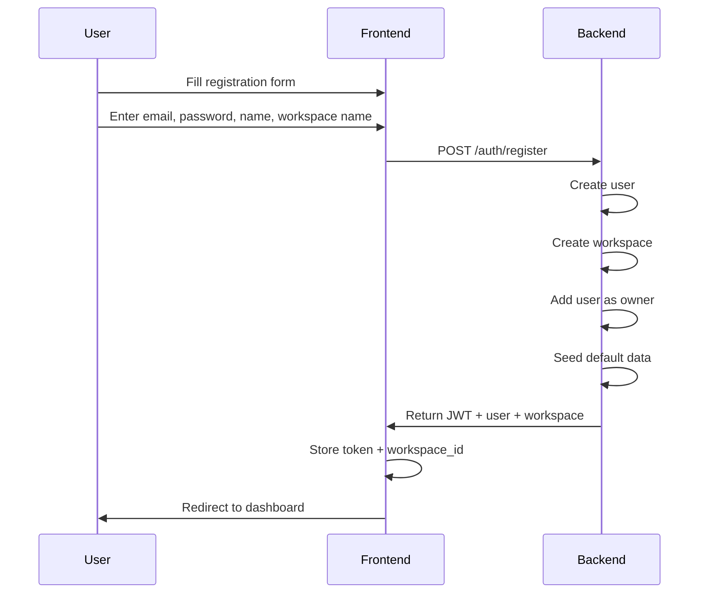
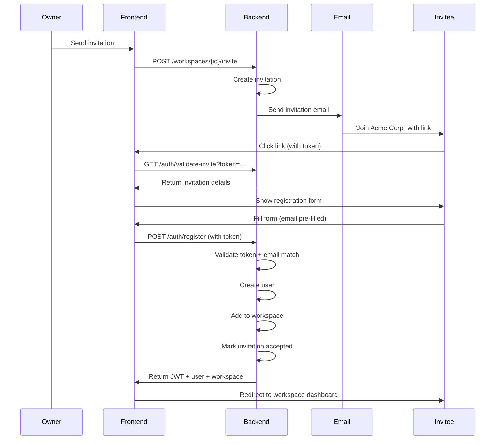
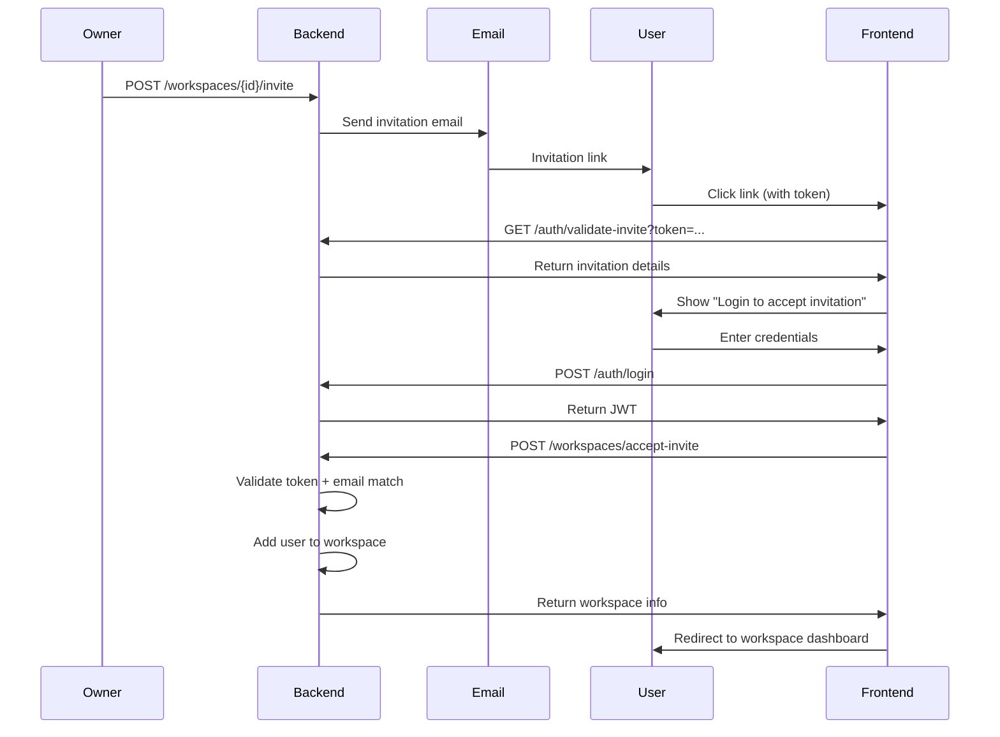
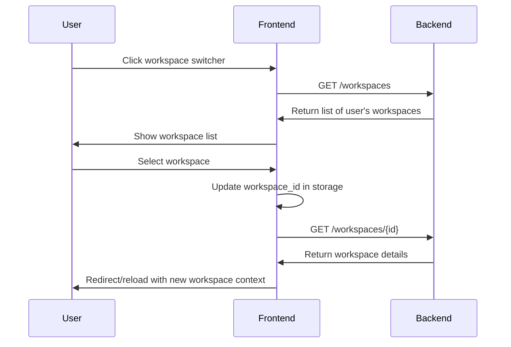

# Authentication & Workspace System Documentation

**Version:** 1.0
**Last Updated:** January 2025
**Target Audience:** Frontend Developers

This document provides complete documentation for the authentication and workspace management system, including all API endpoints, request/response formats, user flows, and integration examples.

---

## Table of Contents

1. [System Overview](#system-overview)
2. [Authentication Flow](#authentication-flow)
3. [Authentication Endpoints](#authentication-endpoints)
4. [Workspace Endpoints](#workspace-endpoints)
5. [Invitation System](#invitation-system)
6. [Complete User Flows](#complete-user-flows)
7. [Security & Best Practices](#security--best-practices)
8. [Error Handling](#error-handling)
9. [Frontend Integration Examples](#frontend-integration-examples)

---

## System Overview

### Architecture

The ERP system uses:
- **JWT (JSON Web Tokens)** for authentication
- **Multi-tenant workspaces** (users can belong to multiple workspaces)
- **Role-Based Access Control (RBAC)** within workspaces
- **Email-based invitation system** for adding users to workspaces

### Key Concepts

**Profile (User)**
- Global user account (email + password)
- Can belong to multiple workspaces
- Same user can have different roles in different workspaces

**Workspace**
- Isolated tenant environment (like Slack workspaces)
- Has owner, members, and subscription plan
- Complete data isolation between workspaces

**Workspace Member**
- Junction between User and Workspace
- Defines user's role in specific workspace
- Roles: `owner`, `finance`, `ground-team-manager`, `ground-team`

**Invitation**
- Email-based invite to join workspace
- Secure token with 7-day expiration
- Email matching required for security

---

## Authentication Flow

### Token-Based Authentication

```
1. User logs in → Backend returns JWT token
2. Frontend stores token (localStorage/cookies)
3. Every API request includes token in Authorization header:
   Authorization: Bearer <token>
4. Backend validates token and extracts user info
5. Backend checks user has access to requested workspace
```

### Required Headers

**For Public Endpoints (Login, Register):**
```http
Content-Type: application/json
```

**For Protected Endpoints (Everything Else):**
```http
Content-Type: application/json
Authorization: Bearer <your_jwt_token>
X-Workspace-ID: <workspace_id>
```

---

## Authentication Endpoints

### Base URL
```
/api/v1/auth
```

---

### 1. Register New User

**Endpoint:** `POST /auth/register`

**Description:** Register a new user account. User can either create their own workspace OR accept an invitation to existing workspace.

**Request Body:**
```json
{
  "email": "user@example.com",
  "password": "SecureP@ssw0rd",
  "name": "John Doe",
  "workspace_name": "Acme Corporation",  // REQUIRED if no invitation_token
  "invitation_token": null                // OPTIONAL - provide if accepting invite
}
```

**Response (Success - 201 Created):**
```json
{
  "access_token": "eyJhbGciOiJIUzI1NiIsInR5cCI6IkpXVCJ9...",
  "token_type": "bearer",
  "user": {
    "id": 123,
    "email": "user@example.com",
    "name": "John Doe",
    "created_at": "2025-01-24T10:30:00Z"
  },
  "workspace": {
    "id": 10,
    "name": "Acme Corporation",
    "role": "owner",           // User's role in this workspace
    "status": "active"
  }
}
```

**Business Logic:**

**Case 1: New User Creating Workspace** (`invitation_token` is `null` or not provided)
```
1. Validate email not already registered
2. Create user account
3. Create workspace with provided workspace_name
4. Add user as workspace owner
5. Seed default data (statuses, departments, tags)
6. Return JWT token + user + workspace
```

**Case 2: New User Accepting Invitation** (`invitation_token` is provided)
```
1. Validate email not already registered
2. Validate invitation token:
   ✅ Token exists
   ✅ Not expired (7-day window)
   ✅ Status is 'pending'
   ✅ user.email matches invitation.email (CRITICAL!)
3. Create user account
4. Add user to invited workspace with specified role
5. Mark invitation as 'accepted'
6. Return JWT token + user + workspace
```

**Error Responses:**

```json
// 409 Conflict - Email already exists
{
  "detail": "Email already registered. Please use a different email or login."
}

// 400 Bad Request - Invalid invitation token
{
  "detail": "Invalid or expired invitation token."
}

// 400 Bad Request - Email mismatch
{
  "detail": "This invitation was sent to work@company.com. You must register with that email address."
}

// 400 Bad Request - Missing workspace name
{
  "detail": "workspace_name is required when not using an invitation token."
}
```

**Frontend Usage:**
```typescript
// New user creating own workspace
const response = await fetch('/api/v1/auth/register', {
  method: 'POST',
  headers: { 'Content-Type': 'application/json' },
  body: JSON.stringify({
    email: 'user@example.com',
    password: 'SecureP@ssw0rd',
    name: 'John Doe',
    workspace_name: 'My Company'
  })
});

// New user accepting invitation
const response = await fetch('/api/v1/auth/register', {
  method: 'POST',
  headers: { 'Content-Type': 'application/json' },
  body: JSON.stringify({
    email: 'user@example.com',
    password: 'SecureP@ssw0rd',
    name: 'John Doe',
    invitation_token: 'abc123xyz...'  // From URL parameter
  })
});

const data = await response.json();
// Store token
localStorage.setItem('auth_token', data.access_token);
localStorage.setItem('workspace_id', data.workspace.id);
// Redirect to dashboard
```

---

### 2. User Login

**Endpoint:** `POST /auth/login`

**Description:** Authenticate user with email and password. Returns JWT token.

**Request Body:**
```json
{
  "email": "user@example.com",
  "password": "SecureP@ssw0rd"
}
```

**Response (Success - 200 OK):**
```json
{
  "access_token": "eyJhbGciOiJIUzI1NiIsInR5cCI6IkpXVCJ9...",
  "token_type": "bearer",
  "user": {
    "id": 123,
    "email": "user@example.com",
    "name": "John Doe",
    "permission": "admin",
    "position": "Manager"
  }
}
```

**Note:** Login returns user data but NOT workspace. After login, frontend should call `GET /workspaces` to get user's workspaces.

**Error Responses:**
```json
// 401 Unauthorized - Invalid credentials
{
  "detail": "Incorrect email or password"
}
```

**Frontend Usage:**
```typescript
const response = await fetch('/api/v1/auth/login', {
  method: 'POST',
  headers: { 'Content-Type': 'application/json' },
  body: JSON.stringify({
    email: 'user@example.com',
    password: 'SecureP@ssw0rd'
  })
});

const data = await response.json();
localStorage.setItem('auth_token', data.access_token);

// After login, get user's workspaces
const workspaces = await fetch('/api/v1/workspaces', {
  headers: {
    'Authorization': `Bearer ${data.access_token}`
  }
});
```

---

### 3. Validate Invitation Token

**Endpoint:** `GET /auth/validate-invite?token=<invitation_token>`

**Description:** Validate invitation token and retrieve invitation details. **PUBLIC ENDPOINT** (no authentication required). Use this before registration to show invitation details to user.

**Query Parameters:**
- `token` (required): The invitation token from email link

**Response (Success - 200 OK):**
```json
{
  "valid": true,
  "email": "john@example.com",
  "workspace_name": "Acme Corporation",
  "workspace_id": 10,
  "role": "ground-team",
  "invited_by_name": "Jane Doe",
  "invited_at": "2025-01-20T10:30:00Z",
  "expires_at": "2025-01-27T10:30:00Z"
}
```

**Response (Invalid Token - 400 Bad Request):**
```json
{
  "valid": false,
  "error": "Invalid or expired invitation token"
}
```

**Frontend Usage:**
```typescript
// User clicks link: https://app.com/accept-invite?token=abc123xyz
const token = new URLSearchParams(window.location.search).get('token');

const response = await fetch(`/api/v1/auth/validate-invite?token=${token}`);
const invitation = await response.json();

if (invitation.valid) {
  // Show registration form with pre-filled email
  // Display: "You've been invited to join {workspace_name} as {role}"
} else {
  // Show error: "Invalid or expired invitation"
}
```

---

### 4. Logout

**Endpoint:** `POST /auth/logout`

**Description:** Logout user. Currently, this is **client-side only** (JWT tokens are stateless). Just clear the token from storage.

**Frontend Implementation:**
```typescript
function logout() {
  // Clear tokens from storage
  localStorage.removeItem('auth_token');
  localStorage.removeItem('workspace_id');

  // Redirect to login
  window.location.href = '/login';
}
```

**Future Enhancement:** Backend token blacklist with Redis (not implemented yet).

---

### 5. Forgot Password

**Endpoint:** `POST /auth/forgot-password`

**Description:** Request password reset email. Generates reset token and sends email to user.

**Request Body:**
```json
{
  "email": "user@example.com"
}
```

**Response (Success - 200 OK):**
```json
{
  "message": "If an account exists with this email, you will receive a password reset link.",
  "email_sent": true
}
```

**Note:** Always returns success even if email doesn't exist (security best practice - prevent email enumeration).

**Frontend Usage:**
```typescript
const response = await fetch('/api/v1/auth/forgot-password', {
  method: 'POST',
  headers: { 'Content-Type': 'application/json' },
  body: JSON.stringify({
    email: 'user@example.com'
  })
});

// Always show: "Check your email for reset instructions"
```

---

### 6. Reset Password (With Token)

**Endpoint:** `POST /auth/reset-password`

**Description:** Reset password using token from email. **PUBLIC ENDPOINT**.

**Request Body:**
```json
{
  "reset_token": "xyz789abc...",
  "new_password": "NewSecureP@ssw0rd"
}
```

**Response (Success - 200 OK):**
```json
{
  "message": "Password successfully reset. You can now login with your new password."
}
```

**Error Responses:**
```json
// 400 Bad Request - Invalid/expired token
{
  "detail": "Invalid or expired reset token. Please request a new password reset."
}

// 400 Bad Request - Weak password
{
  "detail": "Password must be at least 8 characters long."
}
```

**Frontend Usage:**
```typescript
// User clicks link: https://app.com/reset-password?token=xyz789abc
const token = new URLSearchParams(window.location.search).get('token');

const response = await fetch('/api/v1/auth/reset-password', {
  method: 'POST',
  headers: { 'Content-Type': 'application/json' },
  body: JSON.stringify({
    reset_token: token,
    new_password: userInputPassword
  })
});

if (response.ok) {
  // Show: "Password reset successful! Please login."
  // Redirect to login page
}
```

---

### 7. Reset Password (Admin for Another User)

**Endpoint:** `POST /auth/reset-password-admin`

**Description:** Admin/Owner resets password for another user. **REQUIRES AUTHENTICATION** and **owner role**.

**Headers:**
```http
Authorization: Bearer <admin_token>
X-Workspace-ID: <workspace_id>
```

**Request Body:**
```json
{
  "user_id": 456,
  "new_password": "TemporaryP@ssw0rd"
}
```

**Response (Success - 200 OK):**
```json
{
  "message": "Password successfully reset for user.",
  "user_email": "john@example.com",
  "notification_sent": true
}
```

**Error Responses:**
```json
// 403 Forbidden - Not owner
{
  "detail": "Only workspace owners can reset passwords for other users."
}

// 404 Not Found - User not in workspace
{
  "detail": "User not found in this workspace."
}
```

**Frontend Usage:**
```typescript
const response = await fetch('/api/v1/auth/reset-password-admin', {
  method: 'POST',
  headers: {
    'Content-Type': 'application/json',
    'Authorization': `Bearer ${token}`,
    'X-Workspace-ID': workspaceId
  },
  body: JSON.stringify({
    user_id: 456,
    new_password: 'TemporaryP@ssw0rd'
  })
});
```

---

### 8. Get Current User

**Endpoint:** `GET /auth/me`

**Description:** Get current authenticated user's profile. Use this to verify token validity and get user info.

**Headers:**
```http
Authorization: Bearer <token>
```

**Response (Success - 200 OK):**
```json
{
  "id": 123,
  "email": "user@example.com",
  "name": "John Doe",
  "permission": "admin",
  "position": "Manager",
  "created_at": "2025-01-01T10:00:00Z"
}
```

**Error Responses:**
```json
// 401 Unauthorized - Invalid/expired token
{
  "detail": "Could not validate credentials"
}
```

**Frontend Usage:**
```typescript
// On app initialization, verify token is valid
const response = await fetch('/api/v1/auth/me', {
  headers: {
    'Authorization': `Bearer ${localStorage.getItem('auth_token')}`
  }
});

if (!response.ok) {
  // Token invalid, redirect to login
  window.location.href = '/login';
}

const user = await response.json();
```

---

## Workspace Endpoints

### Base URL
```
/api/v1/workspaces
```

**All workspace endpoints require authentication.**

---

### 1. List User's Workspaces

**Endpoint:** `GET /workspaces`

**Description:** Get all workspaces the current user belongs to. Call this after login to let user select workspace.

**Headers:**
```http
Authorization: Bearer <token>
```

**Response (Success - 200 OK):**
```json
[
  {
    "id": 10,
    "name": "Acme Corporation",
    "role": "owner",
    "status": "active",
    "subscription_plan": "pro",
    "member_count": 15,
    "created_at": "2025-01-01T10:00:00Z"
  },
  {
    "id": 25,
    "name": "Side Project LLC",
    "role": "ground-team",
    "status": "active",
    "subscription_plan": "free",
    "member_count": 3,
    "created_at": "2025-01-15T14:30:00Z"
  }
]
```

**Frontend Usage:**
```typescript
const response = await fetch('/api/v1/workspaces', {
  headers: {
    'Authorization': `Bearer ${token}`
  }
});

const workspaces = await response.json();

// If multiple workspaces, show workspace selector
// If single workspace, auto-select and store workspace_id
// If no workspaces, show error (shouldn't happen with current registration flow)
```

---

### 2. Get Workspace Details

**Endpoint:** `GET /workspaces/{workspace_id}`

**Description:** Get detailed information about a specific workspace.

**Headers:**
```http
Authorization: Bearer <token>
X-Workspace-ID: <workspace_id>
```

**Response (Success - 200 OK):**
```json
{
  "id": 10,
  "name": "Acme Corporation",
  "owner_user_id": 100,
  "owner_name": "Jane Doe",
  "subscription_plan": {
    "id": 2,
    "name": "Pro",
    "max_members": 50,
    "max_storage_mb": 10240,
    "price_monthly": 99.00
  },
  "member_count": 15,
  "status": "active",
  "trial_ends_at": null,
  "created_at": "2025-01-01T10:00:00Z"
}
```

**Frontend Usage:**
```typescript
const response = await fetch(`/api/v1/workspaces/${workspaceId}`, {
  headers: {
    'Authorization': `Bearer ${token}`,
    'X-Workspace-ID': workspaceId
  }
});

const workspace = await response.json();
```

---

### 3. Create New Workspace

**Endpoint:** `POST /workspaces`

**Description:** Create a new workspace. User becomes owner of the new workspace.

**Headers:**
```http
Authorization: Bearer <token>
```

**Request Body:**
```json
{
  "name": "New Company Inc",
  "subscription_plan_id": 1  // Optional - defaults to free plan
}
```

**Response (Success - 201 Created):**
```json
{
  "id": 30,
  "name": "New Company Inc",
  "owner_user_id": 123,
  "subscription_plan_id": 1,
  "status": "active",
  "trial_ends_at": "2025-02-07T10:30:00Z",  // 14-day trial
  "created_at": "2025-01-24T10:30:00Z"
}
```

**Frontend Usage:**
```typescript
const response = await fetch('/api/v1/workspaces', {
  method: 'POST',
  headers: {
    'Content-Type': 'application/json',
    'Authorization': `Bearer ${token}`
  },
  body: JSON.stringify({
    name: 'New Company Inc'
  })
});

const workspace = await response.json();
// Store new workspace_id and switch to it
localStorage.setItem('workspace_id', workspace.id);
```

---

### 4. Update Workspace

**Endpoint:** `PUT /workspaces/{workspace_id}`

**Description:** Update workspace details. **Only owner can update.**

**Headers:**
```http
Authorization: Bearer <token>
X-Workspace-ID: <workspace_id>
```

**Request Body:**
```json
{
  "name": "Acme Corp (Updated)"
}
```

**Response (Success - 200 OK):**
```json
{
  "id": 10,
  "name": "Acme Corp (Updated)",
  "owner_user_id": 100,
  "updated_at": "2025-01-24T11:00:00Z"
}
```

**Error Responses:**
```json
// 403 Forbidden - Not owner
{
  "detail": "Only workspace owner can update workspace details."
}
```

---

### 5. List Workspace Members

**Endpoint:** `GET /workspaces/{workspace_id}/members`

**Description:** Get all members of a workspace with their roles.

**Headers:**
```http
Authorization: Bearer <token>
X-Workspace-ID: <workspace_id>
```

**Response (Success - 200 OK):**
```json
[
  {
    "user_id": 100,
    "name": "Jane Doe",
    "email": "jane@example.com",
    "role": "owner",
    "status": "active",
    "joined_at": "2025-01-01T10:00:00Z"
  },
  {
    "user_id": 123,
    "name": "John Doe",
    "email": "john@example.com",
    "role": "ground-team",
    "status": "active",
    "joined_at": "2025-01-10T14:30:00Z"
  }
]
```

**Frontend Usage:**
```typescript
const response = await fetch(`/api/v1/workspaces/${workspaceId}/members`, {
  headers: {
    'Authorization': `Bearer ${token}`,
    'X-Workspace-ID': workspaceId
  }
});

const members = await response.json();
// Display in team management UI
```

---

### 6. Send Workspace Invitation

**Endpoint:** `POST /workspaces/{workspace_id}/invite`

**Description:** Invite a user to join workspace via email. Sends invitation email with secure token.

**Headers:**
```http
Authorization: Bearer <token>
X-Workspace-ID: <workspace_id>
```

**Request Body:**
```json
{
  "email": "newuser@example.com",
  "role": "ground-team"
}
```

**Response (Success - 201 Created):**
```json
{
  "id": 42,
  "email": "newuser@example.com",
  "workspace_id": 10,
  "workspace_name": "Acme Corporation",
  "role": "ground-team",
  "invitation_token": "abc123xyz...",  // For testing - not normally exposed
  "invited_by": 100,
  "invited_by_name": "Jane Doe",
  "status": "pending",
  "expires_at": "2025-01-31T10:30:00Z",
  "created_at": "2025-01-24T10:30:00Z"
}
```

**Error Responses:**
```json
// 400 Bad Request - User already member
{
  "detail": "User with this email is already a member of this workspace."
}

// 400 Bad Request - Already invited
{
  "detail": "An invitation has already been sent to this email."
}

// 403 Forbidden - Subscription limit
{
  "detail": "Workspace has reached maximum member limit (50). Upgrade subscription to add more members."
}

// 403 Forbidden - No permission
{
  "detail": "Only workspace owners and managers can send invitations."
}
```

**Frontend Usage:**
```typescript
const response = await fetch(`/api/v1/workspaces/${workspaceId}/invite`, {
  method: 'POST',
  headers: {
    'Content-Type': 'application/json',
    'Authorization': `Bearer ${token}`,
    'X-Workspace-ID': workspaceId
  },
  body: JSON.stringify({
    email: 'newuser@example.com',
    role: 'ground-team'
  })
});

if (response.ok) {
  // Show success: "Invitation sent to newuser@example.com"
}
```

---

### 7. Accept Workspace Invitation (Existing User)

**Endpoint:** `POST /workspaces/accept-invite`

**Description:** Accept workspace invitation. Use this when user **already has an account** and is logged in.

**Headers:**
```http
Authorization: Bearer <token>
```

**Request Body:**
```json
{
  "invitation_token": "abc123xyz..."
}
```

**Response (Success - 200 OK):**
```json
{
  "workspace": {
    "id": 10,
    "name": "Acme Corporation",
    "role": "ground-team"
  },
  "message": "Successfully joined Acme Corporation workspace"
}
```

**Error Responses:**
```json
// 400 Bad Request - Invalid token
{
  "detail": "Invalid or expired invitation token."
}

// 400 Bad Request - Email mismatch
{
  "detail": "This invitation was sent to work@company.com but you are logged in as personal@gmail.com."
}

// 400 Bad Request - Already member
{
  "detail": "You are already a member of this workspace."
}
```

**Frontend Usage:**
```typescript
// User is already logged in and clicks invitation link
const token = new URLSearchParams(window.location.search).get('token');

const response = await fetch('/api/v1/workspaces/accept-invite', {
  method: 'POST',
  headers: {
    'Content-Type': 'application/json',
    'Authorization': `Bearer ${authToken}`
  },
  body: JSON.stringify({
    invitation_token: token
  })
});

const result = await response.json();
// Switch to new workspace
localStorage.setItem('workspace_id', result.workspace.id);
```

---

### 8. List Pending Invitations

**Endpoint:** `GET /workspaces/{workspace_id}/invitations`

**Description:** Get all pending invitations for workspace. **Only owner/manager can view.**

**Headers:**
```http
Authorization: Bearer <token>
X-Workspace-ID: <workspace_id>
```

**Response (Success - 200 OK):**
```json
[
  {
    "id": 42,
    "email": "newuser@example.com",
    "role": "ground-team",
    "invited_by_name": "Jane Doe",
    "status": "pending",
    "expires_at": "2025-01-31T10:30:00Z",
    "created_at": "2025-01-24T10:30:00Z"
  }
]
```

**Frontend Usage:**
```typescript
const response = await fetch(`/api/v1/workspaces/${workspaceId}/invitations`, {
  headers: {
    'Authorization': `Bearer ${token}`,
    'X-Workspace-ID': workspaceId
  }
});

const invitations = await response.json();
// Display in admin panel with "Cancel" button for each
```

---

### 9. Cancel Invitation

**Endpoint:** `DELETE /workspaces/{workspace_id}/invitations/{invitation_id}`

**Description:** Cancel pending invitation. **Only owner/manager or inviter can cancel.**

**Headers:**
```http
Authorization: Bearer <token>
X-Workspace-ID: <workspace_id>
```

**Response (Success - 200 OK):**
```json
{
  "message": "Invitation cancelled successfully"
}
```

**Frontend Usage:**
```typescript
const response = await fetch(
  `/api/v1/workspaces/${workspaceId}/invitations/${invitationId}`,
  {
    method: 'DELETE',
    headers: {
      'Authorization': `Bearer ${token}`,
      'X-Workspace-ID': workspaceId
    }
  }
);
```

---

### 10. Remove Member from Workspace

**Endpoint:** `DELETE /workspaces/{workspace_id}/members/{user_id}`

**Description:** Remove member from workspace. **Owner can remove anyone, managers can remove ground-team only.**

**Headers:**
```http
Authorization: Bearer <token>
X-Workspace-ID: <workspace_id>
```

**Response (Success - 200 OK):**
```json
{
  "message": "User removed from workspace successfully"
}
```

**Error Responses:**
```json
// 400 Bad Request - Cannot remove owner
{
  "detail": "Cannot remove workspace owner. Transfer ownership first."
}

// 403 Forbidden - Insufficient permissions
{
  "detail": "You do not have permission to remove this user."
}
```

**Frontend Usage:**
```typescript
const response = await fetch(
  `/api/v1/workspaces/${workspaceId}/members/${userId}`,
  {
    method: 'DELETE',
    headers: {
      'Authorization': `Bearer ${token}`,
      'X-Workspace-ID': workspaceId
    }
  }
);
```

---

## Invitation System

### How Invitations Work

**1. Owner Sends Invitation**
```
POST /workspaces/{id}/invite
↓
Backend creates invitation with:
- Unique random token (cryptographically secure)
- Email of invitee
- Role assignment
- 7-day expiration
↓
Email sent to invitee with link:
https://app.com/accept-invite?token=abc123xyz
```

**2. Invitee Clicks Link**
```
Frontend extracts token from URL
↓
GET /auth/validate-invite?token=abc123xyz
↓
If valid, show registration/login form with pre-filled email
```

**3a. New User Path**
```
POST /auth/register
{
  "email": "...",
  "password": "...",
  "invitation_token": "abc123xyz"
}
↓
Backend validates token and email match
↓
User created + added to workspace
↓
Returns JWT token + workspace info
```

**3b. Existing User Path**
```
POST /auth/login (if not logged in)
↓
POST /workspaces/accept-invite
{
  "invitation_token": "abc123xyz"
}
↓
Backend validates token and email match
↓
User added to workspace
```

### Security Mechanisms

**Email Verification:**
- Token is useless without matching email
- `invitation.email` must equal `user.email`
- Prevents token leakage attacks

**Token Properties:**
- Generated with `secrets.token_urlsafe(32)` (256-bit entropy)
- Unpredictable and unguessable
- Single-use (marked as 'accepted' after use)
- Time-limited (7-day expiration)

**Database Constraints:**
- Unique token per invitation
- Cannot invite same email twice to same workspace
- Cannot accept invitation for workspace you're already in

---

## Complete User Flows

### Flow 1: New User Creates Workspace



**Implementation:**
```typescript
async function registerNewUser(formData) {
  const response = await fetch('/api/v1/auth/register', {
    method: 'POST',
    headers: { 'Content-Type': 'application/json' },
    body: JSON.stringify({
      email: formData.email,
      password: formData.password,
      name: formData.name,
      workspace_name: formData.workspaceName
    })
  });

  if (!response.ok) {
    const error = await response.json();
    throw new Error(error.detail);
  }

  const data = await response.json();

  // Store credentials
  localStorage.setItem('auth_token', data.access_token);
  localStorage.setItem('workspace_id', data.workspace.id);
  localStorage.setItem('user', JSON.stringify(data.user));

  // Redirect to dashboard
  window.location.href = '/dashboard';
}
```

---

### Flow 2: User Invited to Existing Workspace (New User)



**Implementation:**
```typescript
// Step 1: Validate invitation on page load
async function validateInvitation(token) {
  const response = await fetch(`/api/v1/auth/validate-invite?token=${token}`);
  const invitation = await response.json();

  if (!invitation.valid) {
    showError('Invalid or expired invitation');
    return null;
  }

  // Show invitation details
  return invitation;
}

// Step 2: Register with invitation
async function registerWithInvitation(formData, invitationToken) {
  const response = await fetch('/api/v1/auth/register', {
    method: 'POST',
    headers: { 'Content-Type': 'application/json' },
    body: JSON.stringify({
      email: formData.email,  // Must match invitation email
      password: formData.password,
      name: formData.name,
      invitation_token: invitationToken
    })
  });

  if (!response.ok) {
    const error = await response.json();
    throw new Error(error.detail);
  }

  const data = await response.json();

  // Store credentials
  localStorage.setItem('auth_token', data.access_token);
  localStorage.setItem('workspace_id', data.workspace.id);

  // Redirect to workspace
  window.location.href = '/dashboard';
}

// Complete flow
async function handleInvitationFlow() {
  const urlParams = new URLSearchParams(window.location.search);
  const token = urlParams.get('token');

  if (!token) {
    showError('No invitation token found');
    return;
  }

  // Validate invitation
  const invitation = await validateInvitation(token);
  if (!invitation) return;

  // Show UI with invitation details
  document.getElementById('invited-workspace').textContent = invitation.workspace_name;
  document.getElementById('invited-role').textContent = invitation.role;
  document.getElementById('email-input').value = invitation.email;
  document.getElementById('email-input').disabled = true;  // Can't change

  // Store token for registration
  window.invitationToken = token;
}
```

---

### Flow 3: User Invited to Existing Workspace (Existing User)



**Implementation:**
```typescript
// Step 1: User lands on invitation page
async function handleExistingUserInvitation(token) {
  // Validate invitation
  const invitation = await validateInvitation(token);
  if (!invitation) return;

  // Check if user is already logged in
  const authToken = localStorage.getItem('auth_token');

  if (authToken) {
    // Already logged in, directly accept invitation
    await acceptInvitation(token, authToken);
  } else {
    // Not logged in, show login form
    showLoginForm(invitation);
    // Store token for after login
    sessionStorage.setItem('pending_invitation', token);
  }
}

// Step 2: After login, accept invitation
async function handlePostLoginInvitation() {
  const token = sessionStorage.getItem('pending_invitation');
  if (!token) return;

  const authToken = localStorage.getItem('auth_token');
  await acceptInvitation(token, authToken);

  // Clear pending invitation
  sessionStorage.removeItem('pending_invitation');
}

// Accept invitation for logged-in user
async function acceptInvitation(invitationToken, authToken) {
  const response = await fetch('/api/v1/workspaces/accept-invite', {
    method: 'POST',
    headers: {
      'Content-Type': 'application/json',
      'Authorization': `Bearer ${authToken}`
    },
    body: JSON.stringify({
      invitation_token: invitationToken
    })
  });

  if (!response.ok) {
    const error = await response.json();
    throw new Error(error.detail);
  }

  const data = await response.json();

  // Switch to new workspace
  localStorage.setItem('workspace_id', data.workspace.id);

  // Redirect to workspace
  window.location.href = '/dashboard';
}
```

---

### Flow 4: User Switches Between Workspaces



**Implementation:**
```typescript
// Get user's workspaces
async function getUserWorkspaces() {
  const response = await fetch('/api/v1/workspaces', {
    headers: {
      'Authorization': `Bearer ${localStorage.getItem('auth_token')}`
    }
  });

  return await response.json();
}

// Switch workspace
async function switchWorkspace(workspaceId) {
  // Update stored workspace
  localStorage.setItem('workspace_id', workspaceId);

  // Get workspace details
  const response = await fetch(`/api/v1/workspaces/${workspaceId}`, {
    headers: {
      'Authorization': `Bearer ${localStorage.getItem('auth_token')}`,
      'X-Workspace-ID': workspaceId
    }
  });

  const workspace = await response.json();

  // Reload app with new workspace context
  window.location.href = '/dashboard';
}
```

---

## Security & Best Practices

### Token Storage

**Recommended: localStorage (Simple SPA)**
```typescript
// Store
localStorage.setItem('auth_token', token);

// Retrieve
const token = localStorage.getItem('auth_token');

// Clear on logout
localStorage.removeItem('auth_token');
```

**Alternative: httpOnly Cookies (More Secure)**
- Backend sets cookie with httpOnly flag
- Automatically sent with requests
- Protected from XSS attacks
- Requires CORS configuration

### Token Expiration Handling

```typescript
async function makeAuthenticatedRequest(url, options = {}) {
  const token = localStorage.getItem('auth_token');

  const response = await fetch(url, {
    ...options,
    headers: {
      ...options.headers,
      'Authorization': `Bearer ${token}`,
      'X-Workspace-ID': localStorage.getItem('workspace_id')
    }
  });

  if (response.status === 401) {
    // Token expired or invalid
    localStorage.clear();
    window.location.href = '/login';
    throw new Error('Authentication required');
  }

  return response;
}
```

### Password Requirements

**Enforce on frontend (backend also validates):**
- Minimum 8 characters
- At least one uppercase letter
- At least one lowercase letter
- At least one number
- At least one special character

```typescript
function validatePassword(password) {
  if (password.length < 8) {
    return 'Password must be at least 8 characters';
  }
  if (!/[A-Z]/.test(password)) {
    return 'Password must contain an uppercase letter';
  }
  if (!/[a-z]/.test(password)) {
    return 'Password must contain a lowercase letter';
  }
  if (!/[0-9]/.test(password)) {
    return 'Password must contain a number';
  }
  if (!/[^A-Za-z0-9]/.test(password)) {
    return 'Password must contain a special character';
  }
  return null;  // Valid
}
```

### Email Validation

```typescript
function validateEmail(email) {
  const emailRegex = /^[^\s@]+@[^\s@]+\.[^\s@]+$/;
  return emailRegex.test(email);
}
```

### CSRF Protection

Not needed for JWT-based API (tokens in headers, not cookies).

### Rate Limiting

Backend implements rate limiting on authentication endpoints:
- Login: 5 attempts per 15 minutes per IP
- Register: 3 attempts per hour per IP
- Forgot Password: 3 attempts per hour per IP

Frontend should handle `429 Too Many Requests`:
```typescript
if (response.status === 429) {
  const error = await response.json();
  showError(`Too many attempts. ${error.retry_after}`);
}
```

---

## Error Handling

### Standard Error Format

All errors follow RFC 7807 format:

```json
{
  "detail": "Human-readable error message",
  "status": 400,
  "type": "validation_error"
}
```

### HTTP Status Codes

| Code | Meaning | Action |
|------|---------|--------|
| 200 | OK | Request succeeded |
| 201 | Created | Resource created |
| 400 | Bad Request | Invalid input, show error to user |
| 401 | Unauthorized | Token missing/invalid, redirect to login |
| 403 | Forbidden | No permission, show error |
| 404 | Not Found | Resource doesn't exist |
| 409 | Conflict | Duplicate resource (e.g., email exists) |
| 422 | Unprocessable Entity | Business rule violation |
| 429 | Too Many Requests | Rate limited, show retry message |
| 500 | Internal Server Error | Backend error, show generic message |

### Error Handling Utility

```typescript
async function handleApiResponse(response) {
  if (response.ok) {
    return await response.json();
  }

  const error = await response.json();

  switch (response.status) {
    case 400:
      throw new Error(error.detail || 'Invalid request');
    case 401:
      localStorage.clear();
      window.location.href = '/login';
      throw new Error('Please login to continue');
    case 403:
      throw new Error(error.detail || 'You do not have permission');
    case 404:
      throw new Error(error.detail || 'Resource not found');
    case 409:
      throw new Error(error.detail || 'Resource already exists');
    case 422:
      throw new Error(error.detail || 'Business rule violation');
    case 429:
      throw new Error('Too many requests. Please try again later.');
    case 500:
      throw new Error('Server error. Please try again later.');
    default:
      throw new Error('An unexpected error occurred');
  }
}

// Usage
try {
  const data = await handleApiResponse(response);
  // Process data
} catch (error) {
  showErrorToast(error.message);
}
```

---

## Frontend Integration Examples

### Complete Authentication Hook (React)

```typescript
// hooks/useAuth.ts
import { useState, useEffect, createContext, useContext } from 'react';

interface User {
  id: number;
  email: string;
  name: string;
}

interface Workspace {
  id: number;
  name: string;
  role: string;
}

interface AuthContext {
  user: User | null;
  workspace: Workspace | null;
  workspaces: Workspace[];
  login: (email: string, password: string) => Promise<void>;
  register: (data: RegisterData) => Promise<void>;
  logout: () => void;
  switchWorkspace: (workspaceId: number) => Promise<void>;
  isAuthenticated: boolean;
  isLoading: boolean;
}

const AuthContext = createContext<AuthContext | null>(null);

export function AuthProvider({ children }) {
  const [user, setUser] = useState<User | null>(null);
  const [workspace, setWorkspace] = useState<Workspace | null>(null);
  const [workspaces, setWorkspaces] = useState<Workspace[]>([]);
  const [isLoading, setIsLoading] = useState(true);

  // Initialize auth on mount
  useEffect(() => {
    initializeAuth();
  }, []);

  async function initializeAuth() {
    const token = localStorage.getItem('auth_token');
    const workspaceId = localStorage.getItem('workspace_id');

    if (!token) {
      setIsLoading(false);
      return;
    }

    try {
      // Get current user
      const userResponse = await fetch('/api/v1/auth/me', {
        headers: { 'Authorization': `Bearer ${token}` }
      });

      if (!userResponse.ok) throw new Error('Invalid token');

      const userData = await userResponse.json();
      setUser(userData);

      // Get user's workspaces
      const workspacesResponse = await fetch('/api/v1/workspaces', {
        headers: { 'Authorization': `Bearer ${token}` }
      });

      const workspacesData = await workspacesResponse.json();
      setWorkspaces(workspacesData);

      // Set current workspace
      if (workspaceId) {
        const currentWorkspace = workspacesData.find(w => w.id === parseInt(workspaceId));
        setWorkspace(currentWorkspace || workspacesData[0]);
      } else if (workspacesData.length > 0) {
        setWorkspace(workspacesData[0]);
        localStorage.setItem('workspace_id', workspacesData[0].id);
      }

    } catch (error) {
      console.error('Auth initialization failed:', error);
      localStorage.clear();
    } finally {
      setIsLoading(false);
    }
  }

  async function login(email: string, password: string) {
    const response = await fetch('/api/v1/auth/login', {
      method: 'POST',
      headers: { 'Content-Type': 'application/json' },
      body: JSON.stringify({ email, password })
    });

    if (!response.ok) {
      const error = await response.json();
      throw new Error(error.detail);
    }

    const data = await response.json();

    localStorage.setItem('auth_token', data.access_token);
    setUser(data.user);

    // Get workspaces after login
    const workspacesResponse = await fetch('/api/v1/workspaces', {
      headers: { 'Authorization': `Bearer ${data.access_token}` }
    });

    const workspacesData = await workspacesResponse.json();
    setWorkspaces(workspacesData);

    if (workspacesData.length > 0) {
      setWorkspace(workspacesData[0]);
      localStorage.setItem('workspace_id', workspacesData[0].id);
    }
  }

  async function register(data: RegisterData) {
    const response = await fetch('/api/v1/auth/register', {
      method: 'POST',
      headers: { 'Content-Type': 'application/json' },
      body: JSON.stringify(data)
    });

    if (!response.ok) {
      const error = await response.json();
      throw new Error(error.detail);
    }

    const result = await response.json();

    localStorage.setItem('auth_token', result.access_token);
    localStorage.setItem('workspace_id', result.workspace.id);

    setUser(result.user);
    setWorkspace(result.workspace);
    setWorkspaces([result.workspace]);
  }

  function logout() {
    localStorage.clear();
    setUser(null);
    setWorkspace(null);
    setWorkspaces([]);
  }

  async function switchWorkspace(workspaceId: number) {
    const ws = workspaces.find(w => w.id === workspaceId);
    if (ws) {
      setWorkspace(ws);
      localStorage.setItem('workspace_id', workspaceId.toString());
    }
  }

  return (
    <AuthContext.Provider value={{
      user,
      workspace,
      workspaces,
      login,
      register,
      logout,
      switchWorkspace,
      isAuthenticated: !!user,
      isLoading
    }}>
      {children}
    </AuthContext.Provider>
  );
}

export function useAuth() {
  const context = useContext(AuthContext);
  if (!context) throw new Error('useAuth must be used within AuthProvider');
  return context;
}
```

### Usage in Components

```typescript
// Login Component
function LoginPage() {
  const { login } = useAuth();
  const [email, setEmail] = useState('');
  const [password, setPassword] = useState('');
  const [error, setError] = useState('');

  async function handleSubmit(e) {
    e.preventDefault();
    setError('');

    try {
      await login(email, password);
      // AuthProvider handles redirect
    } catch (err) {
      setError(err.message);
    }
  }

  return (
    <form onSubmit={handleSubmit}>
      <input
        type="email"
        value={email}
        onChange={e => setEmail(e.target.value)}
        required
      />
      <input
        type="password"
        value={password}
        onChange={e => setPassword(e.target.value)}
        required
      />
      {error && <div className="error">{error}</div>}
      <button type="submit">Login</button>
    </form>
  );
}

// Protected Route
function ProtectedRoute({ children }) {
  const { isAuthenticated, isLoading } = useAuth();

  if (isLoading) return <LoadingSpinner />;
  if (!isAuthenticated) return <Navigate to="/login" />;

  return children;
}

// Workspace Switcher
function WorkspaceSwitcher() {
  const { workspace, workspaces, switchWorkspace } = useAuth();

  return (
    <select
      value={workspace?.id}
      onChange={e => switchWorkspace(parseInt(e.target.value))}
    >
      {workspaces.map(ws => (
        <option key={ws.id} value={ws.id}>
          {ws.name} ({ws.role})
        </option>
      ))}
    </select>
  );
}
```

---

## API Request Utility

### Axios Configuration

```typescript
// api/client.ts
import axios from 'axios';

const apiClient = axios.create({
  baseURL: '/api/v1',
  headers: {
    'Content-Type': 'application/json'
  }
});

// Request interceptor - add auth headers
apiClient.interceptors.request.use(config => {
  const token = localStorage.getItem('auth_token');
  const workspaceId = localStorage.getItem('workspace_id');

  if (token) {
    config.headers.Authorization = `Bearer ${token}`;
  }

  if (workspaceId) {
    config.headers['X-Workspace-ID'] = workspaceId;
  }

  return config;
});

// Response interceptor - handle errors
apiClient.interceptors.response.use(
  response => response,
  error => {
    if (error.response?.status === 401) {
      // Token expired
      localStorage.clear();
      window.location.href = '/login';
    }

    return Promise.reject(error);
  }
);

export default apiClient;
```

### Usage

```typescript
import apiClient from './api/client';

// Login (no workspace needed)
const loginResponse = await apiClient.post('/auth/login', {
  email: 'user@example.com',
  password: 'password'
});

// Protected request (auto-adds headers)
const orders = await apiClient.get('/orders');

// Create order
const newOrder = await apiClient.post('/orders', orderData);
```

---

## Testing Checklist

### Authentication Tests

- [ ] Register new user with valid data
- [ ] Register with existing email (should fail)
- [ ] Register with weak password (should fail)
- [ ] Login with valid credentials
- [ ] Login with invalid credentials (should fail)
- [ ] Access protected endpoint without token (should fail)
- [ ] Access protected endpoint with expired token (should fail)
- [ ] Access protected endpoint with valid token (should succeed)

### Workspace Tests

- [ ] Create workspace after registration
- [ ] List user's workspaces
- [ ] Switch between workspaces
- [ ] Update workspace details (owner only)
- [ ] Delete workspace (owner only)

### Invitation Tests

- [ ] Send invitation to new user
- [ ] Send invitation to existing user
- [ ] Cannot invite same email twice
- [ ] Validate invitation token (public endpoint)
- [ ] Register with invitation token
- [ ] Accept invitation as existing user
- [ ] Try to use expired invitation (should fail)
- [ ] Try to use wrong email with invitation (should fail)
- [ ] Cancel pending invitation
- [ ] List pending invitations

### Permission Tests

- [ ] Owner can invite members
- [ ] Manager can invite members
- [ ] Ground-team cannot invite members
- [ ] Owner can remove any member
- [ ] Manager can remove ground-team only
- [ ] Cannot remove workspace owner
- [ ] Access endpoint without workspace header (should fail)
- [ ] Access workspace user doesn't belong to (should fail)

---

## Changelog

**Version 1.0 - January 2025**
- Initial documentation
- JWT-based authentication
- Multi-tenant workspace system
- Email-based invitation flow
- Role-based access control

---

## Support

For questions or issues:
- Backend Team: [backend-team@company.com]
- API Documentation: http://localhost:8000/docs (Swagger UI)
- System Architecture: See `CLAUDE.md` in repository

---

**End of Documentation**
